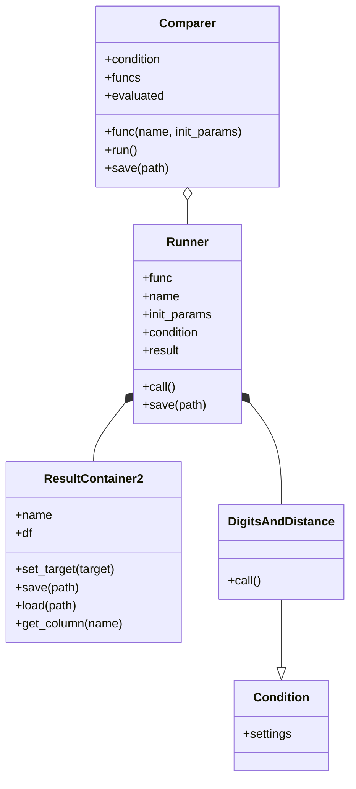
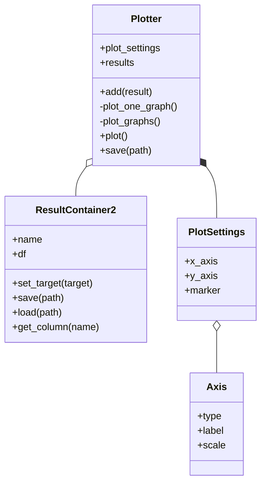

# find-PI

https://qiita.com/glyzinieh/items/691f8c626131b40849df

## クラス図

### 実行

```mermaid
classDiagram
    class ResultContainer2 {
        +name
        +df

        +set_target(target)
        +save(path)
        +load(path)
        +get_column(name)
    }

    class Comparer {
        +condition
        +funcs
        +evaluated

        +func(name, init_params)
        +run()
        +save(path)
    }

    class Runner {
        +func
        +name
        +init_params
        +condition
        +result

        +call()
        +save(path)
    }

    class Condition {
        +settings
    }

    class DigitsAndDistance {
        +call()
    }

    Comparer o-- Runner

    Runner *-- DigitsAndDistance
    Runner *-- ResultContainer2

    DigitsAndDistance --|> Condition
```

### プロット

```mermaid
classDiagram
    class ResultContainer2 {
        +name
        +df

        +set_target(target)
        +save(path)
        +load(path)
        +get_column(name)
    }

    class Axis {
        +type
        +label
        +scale
    }

    class PlotSettings {
        +x_axis
        +y_axis
        +marker
    }

    class Plotter {
        +plot_settings
        +results

        +add(result)
        -plot_one_graph()
        -plot_graphs()
        +plot()
        +save(path)
    }

    Plotter *-- PlotSettings
    Plotter o-- ResultContainer2

    PlotSettings o-- Axis
```
