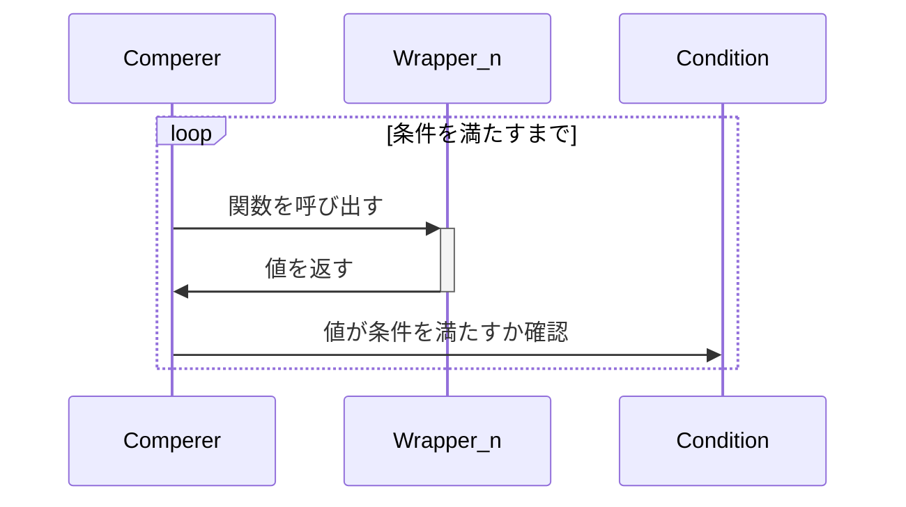

# find-PI

https://qiita.com/glyzinieh/items/691f8c626131b40849df

## シーケンス図

```mermaid
sequenceDiagram
    loop 条件を満たすまで
        Comperer ->>+ Wrapper_n: 関数を呼び出す
        Wrapper_n ->>- Comperer: 値を返す
        Comperer ->> Condition: 値が条件を満たすか確認
    end
```
